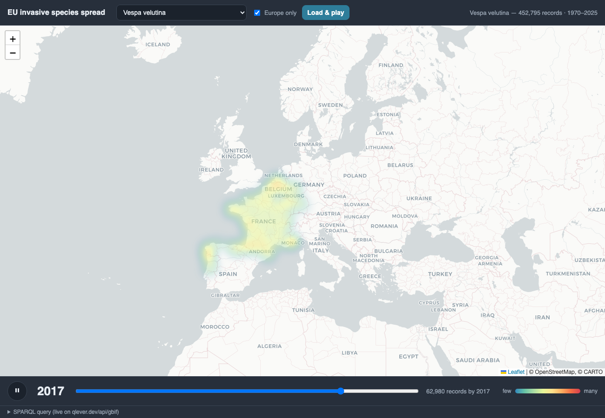

# EU invasive alien species — spread over time

An interactive map that animates the spread of any species on the
**EU list of Invasive Alien Species of Union concern** using **live GBIF
occurrence data**, queried through the **QLever** SPARQL endpoint.

➡️ **Live demo:** `https://<your-user>.github.io/eu-invasive-spread-gbif/`



## What it does

- Pick any of the ~110 Union-list species.
- It runs a live SPARQL query against `https://qlever.dev/api/gbif`, fetching
  occurrence counts gridded by 0.05° cell **and year**.
- A heatmap **walks through the years**, showing cumulative spread (slider to
  scrub, ▶/⏸ to play, *Europe only* toggle). The live query is shown at the bottom.

## How it works

- Each EU name is mapped to its **GBIF backbone id**. The five synonyms on the
  list are resolved to their **accepted** key, and `skos:broader*` pulls in any
  **subspecies** (e.g. *Vespa velutina nigrithorax*).
- Year is derived from `dwc:eventDate`; coordinates from
  `dwc:decimalLatitude`/`Longitude`; the occurrence→taxon link is `dwciri:toTaxon`.
- Rendering: [Leaflet](https://leafletjs.com) + Leaflet.heat, CARTO basemap.

It's a single static `index.html` — no build step, no backend.

## Caveats

- The heat is **log-scaled record density**, not true abundance.
- Early years reflect GBIF **date-quality quirks** (placeholder/mis-dated records);
  the *expansion pattern* is the reliable signal.
- Species with no georeferenced GBIF records show an empty map with a message.

## Run locally

Just open `index.html`, or serve it (avoids any file:// quirks):

```bash
python3 -m http.server 8000
# then open http://localhost:8000
```

## Deploy to GitHub Pages

```bash
# from this folder, after git init + commit (see below)
gh repo create eu-invasive-spread-gbif --public --source=. --remote=origin --push
# enable Pages on the main branch / root:
gh api -X POST repos/$(gh api user -q .login)/eu-invasive-spread-gbif/pages \
  -f build_type=legacy -f 'source[branch]=main' -f 'source[path]=/'
```

Or via the web UI: **Settings → Pages → Source: Deploy from a branch → `main` / `/ (root)`**.

## Credits / data

GBIF occurrence data via the [QLever](https://qlever.dev) SPARQL engine
(University of Freiburg). Basemap © OpenStreetMap, © CARTO. Species list:
EU Implementing Regulation (Union list of Invasive Alien Species of Union concern).
